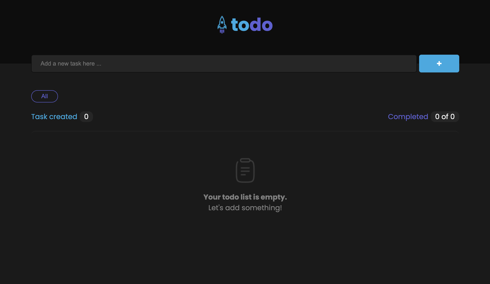
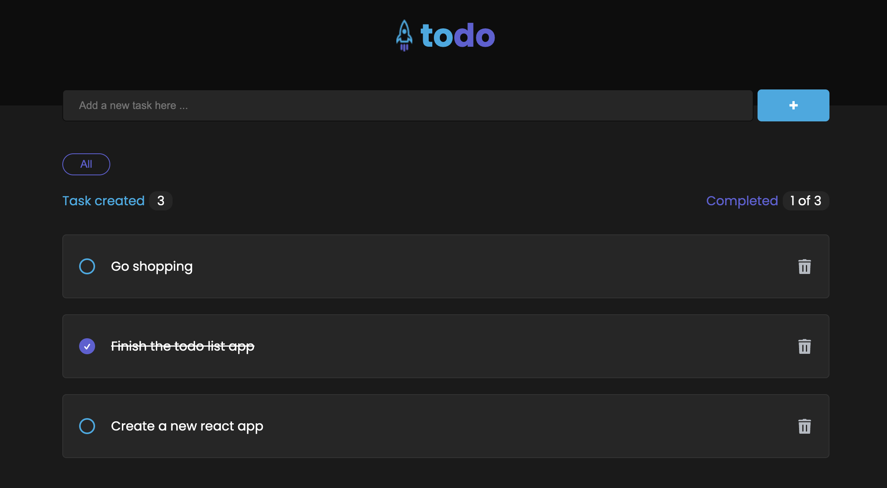

# Todo-List App

A simple Todo-list app built with Create React App. This app allows users to manage their tasks by adding, editing, and deleting items from their todo list.




## Features

- **Task Management**: Add, edit, and delete tasks from the todo list.
- **Checklist**: Mark tasks as completed or pending.
- **Filtering**: Filter tasks by status (all, undo).

## Installation

1. Clone the repository:

   ```bash
   git clone https://github.com/Kz0804/todo-list.git
   ```

2. Navigate to the project directory:

   ```bash
   cd todo-list
   ```

3. Install dependencies:

   ```bash
   npm install
   ```

4. Start the development server:

   ```bash
   npm start
   ```

5. Open your browser and navigate to `http://localhost:3000` to view the app.

## Usage

- Add a new task by entering text in the input field and pressing enter.
- Mark a task as completed by clicking on the checkbox.
- Delete a task by clicking on the delete button.
- Use the filter buttons to show all tasks, completed tasks, or pending tasks.
